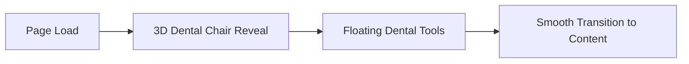

# Olive Vine Dental Clinic - Premium Website Implementation Plan

## Research Summary

### Current Digital Footprint
**Olive Vine Dental Clinic** is located at **Suite C108, Garki Mall**, opposite Garki International Market, Abuja, Nigeria.

| Attribute | Details |
|-----------|---------|
| **Location** | Suite C108, Garki Mall, Abuja |
| **Phone** | 0703 229 9287 |
| **Hours** | Mon-Fri: 9AM-5PM, Sat: 10AM-3PM, Sun: Closed |
| **Services** | General dentistry, cosmetic dentistry, orthodontics, restorative procedures |

> [!IMPORTANT]
> The clinic currently has minimal online presence through directory listings only. This represents a significant opportunity to establish a dominant digital presence in Abuja's dental market.

---

## Proposed Hero Features

### 1. Immersive 3D Hero Experience


- **3D Dental Chair Animation**: Premium dental chair that morphs/rotates as users scroll
- **Interactive Dental Equipment**: Floating, orbiting dental tools (mirror, probe, scaler) with hover interactions
- **Particle Effects**: Subtle sparkle/clean particles suggesting pristine hygiene

### 2. Procedure Visualization Gallery
- **3D Tooth Model**: Interactive tooth users can rotate, with clickable layers showing enamel, dentin, pulp
- **Treatment Animations**: Smooth 3D visualizations of implants, crowns, veneers being placed

### 3. Surgeon Spotlight Section
- **Parallax Profile**: Dr.'s image with depth layers creating 3D effect
- **Credential Carousel**: Animated display of qualifications and leadership roles
- **Community Connection**: Subtle integration of pastoral role showing holistic care philosophy

### 4. Smart Booking Experience
- **Visual Calendar**: Elegant availability visualization with blocked times (Sundays, Wednesday evenings)
- **Service-Based Duration**: Intelligent time slot allocation based on procedure type
- **Confirmation Animation**: Satisfying 3D checkmark animation on successful booking

---

## Tech Stack Recommendation

| Layer | Technology | Rationale |
|-------|------------|-----------|
| **Framework** | Next.js 14 (App Router) | SSR, optimal performance, SEO |
| **3D Graphics** | Three.js + React Three Fiber | Industry-standard, performant 3D |
| **Animation** | Framer Motion + GSAP | Smooth micro-animations & scroll effects |
| **Styling** | CSS Modules + CSS Variables | Maximum flexibility, no bloat |
| **Fonts** | Google Fonts (Playfair Display + Inter) | Premium typography pairing |
| **State** | Zustand | Lightweight booking state management |
| **Calendar** | Custom + date-fns | Full control over scheduling logic |

---

## Proposed Changes

### Core Structure

#### [NEW] [package.json](file:///d:/PROJECTS/2025/Dev/OliveVineDentalClinic/package.json)
Next.js 14 project with Three.js, React Three Fiber, Framer Motion, GSAP dependencies.

#### [NEW] [src/app/layout.tsx](file:///d:/PROJECTS/2025/Dev/OliveVineDentalClinic/src/app/layout.tsx)
Root layout with premium fonts, metadata, and global styles.

---

### Design System

#### [NEW] [src/styles/design-tokens.css](file:///d:/PROJECTS/2025/Dev/OliveVineDentalClinic/src/styles/design-tokens.css)
Premium color palette (deep navy, gold accents, pristine whites), typography scale, spacing system.

#### [NEW] [src/styles/globals.css](file:///d:/PROJECTS/2025/Dev/OliveVineDentalClinic/src/styles/globals.css)
Base styles, smooth scrolling, custom cursor, selection colors.

---

### 3D Components

#### [NEW] [src/components/3d/DentalChair.tsx](file:///d:/PROJECTS/2025/Dev/OliveVineDentalClinic/src/components/3d/DentalChair.tsx)
Interactive 3D dental chair with scroll-triggered rotation and ambient lighting.

#### [NEW] [src/components/3d/FloatingTools.tsx](file:///d:/PROJECTS/2025/Dev/OliveVineDentalClinic/src/components/3d/FloatingTools.tsx)
Orbiting dental instruments with hover-to-pause interaction.

#### [NEW] [src/components/3d/ToothModel.tsx](file:///d:/PROJECTS/2025/Dev/OliveVineDentalClinic/src/components/3d/ToothModel.tsx)
Interactive tooth anatomy visualization with clickable layers.

---

### Pages

#### [NEW] [src/app/page.tsx](file:///d:/PROJECTS/2025/Dev/OliveVineDentalClinic/src/app/page.tsx)
Home page with hero, services preview, surgeon spotlight, testimonials, booking CTA.

#### [NEW] [src/app/about/page.tsx](file:///d:/PROJECTS/2025/Dev/OliveVineDentalClinic/src/app/about/page.tsx)
Surgeon profile with credentials, leadership roles, and clinic philosophy.

#### [NEW] [src/app/services/page.tsx](file:///d:/PROJECTS/2025/Dev/OliveVineDentalClinic/src/app/services/page.tsx)
Service showcase with 3D procedure visualizations.

#### [NEW] [src/app/booking/page.tsx](file:///d:/PROJECTS/2025/Dev/OliveVineDentalClinic/src/app/booking/page.tsx)
Smart booking system with availability constraints enforced.

---

### Booking System

#### [NEW] [src/lib/scheduling.ts](file:///d:/PROJECTS/2025/Dev/OliveVineDentalClinic/src/lib/scheduling.ts)
Core scheduling logic with unavailability rules:
- **Sundays**: Completely blocked
- **Wednesday evenings (after 5PM)**: Blocked for church services
- Service-based duration allocation

#### [NEW] [src/components/booking/Calendar.tsx](file:///d:/PROJECTS/2025/Dev/OliveVineDentalClinic/src/components/booking/Calendar.tsx)
Visual calendar with elegant blocked-time indicators.

---

## Verification Plan

### Automated Tests
```bash
npm run build          # Verify production build
npm run lint           # Code quality check
npm run test           # Component tests
```

### Browser Testing
- Chrome, Firefox, Safari, Edge compatibility
- Mobile responsiveness (iOS Safari, Chrome Android)

### Performance Metrics
- Lighthouse score > 90 (Performance, Accessibility, SEO)
- First Contentful Paint < 1.5s
- 3D assets lazy-loaded, compressed with Draco

---

## User Review Required

> [!IMPORTANT]
> **Design Direction**: Should we pursue a dark luxury theme (deep navy/gold) or light premium theme (whites/soft greens)?

> [!IMPORTANT]
> **3D Complexity Level**: Full 3D dental chair model vs. stylized geometric representation? Full realism requires more load time.

> [!IMPORTANT]
> **Booking Backend**: Should appointments save locally (demo) or integrate with a real backend/database?
